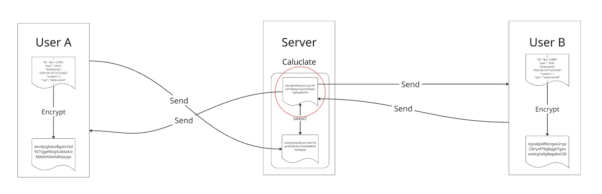
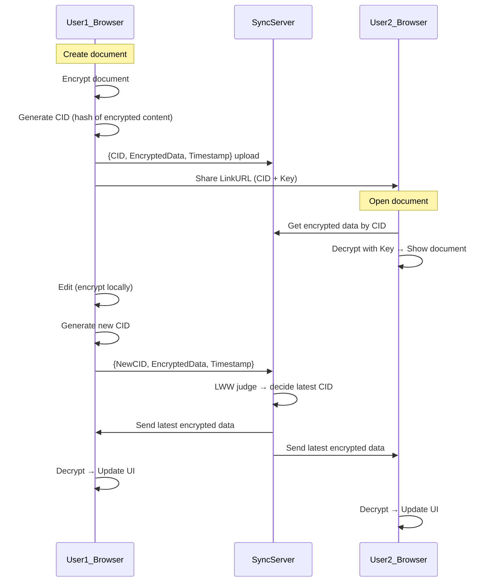

# encrypted-AutoMerge

## Table of Contents

- [Introduction](#introduction)
- [Background](#background)
  - [What is CRDT?](#what-is-crdt)
  - [What is FHE?](#what-is-fhe)
  - [What is TFHE?](#what-is-tfhe)
  - [What is LWW?](#what-is-lww)
  - [Fundamental Premise](#fundamental-premise)
- [System Overview](#system-overview)
- [Sequence Diagram](#sequence-diagram)
- [Prototype Implementation](#prototype-implementation)
  - [Basic Flow](#basic-flow)
  - [Implementation of Encrypted Comparison](#implementation-of-encrypted-comparison)
  - [Conditional Selection (MUX)](#conditional-selection-mux)
  - [Synchronization via WebSocket](#synchronization-via-websocket)
- [Future Directions](#future-directions)
  - [Toward Distributed Auto-Merge](#toward-distributed-auto-merge)
  - [Toward Text-based CRDT under Encryption](#toward-text-based-crdt-under-encryption)
  - [Client-side Merge with Proofs](#client-side-merge-with-proofs)

## Introduction

encrypted-AutoMerge is an implementation that realizes automatic content merging by combining **Fully Homomorphic Encryption (FHE)** and **CRDT (Conflict-free Replicated Data Type)** mechanisms. This system is designed with **End-to-End Encryption (E2EE)** as a fundamental premise, ensuring that no one except the users who hold sovereignty over the data can access the content or metadata.

Our team is developing Monas, a distributed system that enables users to have complete sovereignty over their data. This implementation is positioned as part of that system, specifically responsible for the functionality to **converge states while keeping content confidential**.

The "AutoMerge" referred to here is a mechanism that automatically resolves conflicts that occur when multiple users update the same content and determines the final state. As a first step in this prototype, we adopted the **LWW (Last-Write-Wins)** policy and realized a method that selects newer content based on timestamp comparison in an encrypted state.

In the future, we aim to perform **differential merging (CRDT merge)** for text in an encrypted state, rather than simple replacement. This document describes the background, implementation, challenges, and future prospects.

## Background

### What is CRDT?

**CRDT (Conflict-free Replicated Data Type)** is a data structure where multiple replicas in a distributed environment can be updated simultaneously yet automatically converge to the same final state. The strength of CRDT lies in its ability to guarantee consistent state without central arbitration.

- Features:
  - Designed to satisfy commutativity, idempotence, and monotonicity
  - Reaches the same final state once all updates are propagated, even with network partitions or delays
- Representative CRDTs:
  - Counters (e.g., G-Counter)
  - Sets (e.g., OR-Set)
  - Text editing (e.g., RGA, Logoot, LSEQ)

Our focus is on CRDTs for text editing, and we aim to integrate string operations while maintaining encryption in the future.

### What is FHE?

**FHE (Fully Homomorphic Encryption)** is an encryption method that allows direct computation on encrypted data, where the decrypted result matches the result of the same computation performed on plaintext.

### What is TFHE?

For this prototype, we adopted **TFHE (Fast Fully Homomorphic Encryption over the Torus)** among FHE schemes. TFHE has particular strength in **Boolean circuits (bit-level processing)** and can efficiently execute operations such as comparisons.

- Features:
  - Based on 1-bit encryption
  - Can execute basic operations like NAND gates in encrypted state
  - Fast bootstrapping enables continuous computation even in deep circuits
- Significance of use:
  - LWW policy requires comparing "which timestamp is newer"

### What is LWW?

**LWW (Last-Write-Wins)** is one of the simplest merge policies in CRDT. When conflicts occur, it adopts the update with the newer timestamp as the winner.

In this prototype, our first goal was to realize LWW in an encrypted state. Specifically, we built a mechanism that compares encrypted timestamps using TFHE and selects the newer update.

### Fundamental Premise

We are currently developing a distributed system called Monas. It contains a group of nodes called State nodes that maintain content states (causal relationships) as a **DAG structure**. While this ensures verifiability, this structure remains a **partial order**, requiring eventual **linearization**.

Currently, we allow applications and developers to freely choose the linearization method (merge policy), and we ourselves are continuing research and discussion on these policies.

This theme addresses a particularly challenging issue: **"automatically merging content including differences while keeping the content confidential"**. Since merging in an encrypted state is not easy and computationally expensive, as a first step, we implemented an LWW method using encrypted timestamp comparison with TFHE. This enables determining "which update is most recent" while maintaining confidentiality and automatically converging the state.

## System Overview


## Sequence Diagram



## Prototype Implementation
This prototype implements **auto-merge based on LWW (Last-Writer-Wins) while maintaining encryption**. The server never decrypts and directly compares and selects encrypted data sent from clients.

### Basic Flow
1. During editing, the client generates an encrypted Timestamp and ID and sends them to the server via WebSocket.
2. The server performs **encrypted comparison** between the existing selected state (past Timestamp, ID) and the received data.
3. It selects the one with the latest update (larger Timestamp) and stores it in encrypted form.
4. The selection result is distributed to all clients. Each client can decrypt and update the UI since they have the key.

### Implementation of Encrypted Comparison
The server uses TFHE's ServerKey to compare encrypted Timestamps.
```rust
fn shortint_gt_digits(
    sk: &ShortintServerKey,
    a: &[ShortintCiphertext],
    b: &[ShortintCiphertext]
) -> ShortintCiphertext {
    let mut eq_prefix = sk.create_trivial(1); // Equal up to this point
    let mut res = sk.create_trivial(0);       // Comparison result (a > b)

    for (da, db) in a.iter().zip(b.iter()) {
        let gt_i = sk.unchecked_greater(da, db); // a_i > b_i ?
        let eq_i = sk.unchecked_equal(da, db);   // a_i == b_i ?

        let term = sk.unchecked_bitand(&eq_prefix, &gt_i);
        res = sk.unchecked_bitor(&res, &term);

        eq_prefix = sk.unchecked_bitand(&eq_prefix, &eq_i);
    }
    res
}
```
This logic enables determining "which Timestamp is newer" without decryption.
The result is returned as an encrypted boolean value and used in the next selection process.

### Conditional Selection (MUX)
Based on the comparison result, it determines which data (new or old) to select in encrypted state.
```rust
fn shortint_mux(
    sk: &ShortintServerKey,
    sel: &ShortintCiphertext,
    x: &ShortintCiphertext,
    y: &ShortintCiphertext
) -> ShortintCiphertext {
    let one = sk.create_trivial(1);
    let not_sel = sk.unchecked_bitxor(&one, sel);

    let lut_and = sk.generate_lookup_table_bivariate(|s, v| if s == 1 { v } else { 0 });
    let a = sk.unchecked_apply_lookup_table_bivariate(sel, x, &lut_and);
    let b = sk.unchecked_apply_lookup_table_bivariate(&not_sel, y, &lut_and);
    sk.unchecked_bitor(&a, &b)
}
```
This allows selecting "the ID corresponding to the newer Timestamp" or "the latest content identifier" while maintaining encryption.

### Synchronization via WebSocket
- Each client sends updates during editing.
- The server performs LWW judgment and broadcasts the selected encrypted data to all clients.
- Clients decrypt and update the UI.

## Future Directions

### Toward Distributed Auto-Merge

While this prototype uses a single synchronization server, the ultimate goal is **automatic merging in a distributed environment**.
In Monas, multiple State nodes exist, each maintaining causal relationships as a DAG structure. Therefore, in the future, we need to achieve both **DAG integration between different State nodes** and **content convergence**.

### Toward Text-based CRDT under Encryption

The ultimate goal of this research is to realize text CRDT merging including differences in an encrypted state, not simple replacement.
Mathematically, this corresponds to finding the **Least Upper Bound**. While the computational complexity increases, we will explore efficiency improvements that can withstand practical use.

### Client-side Merge with Proofs

Another option is to perform merging on the client side after decryption. In this case, merging in encrypted state becomes unnecessary, making it more feasible.
However, in that case, State nodes and other participants cannot directly verify whether "the merge was performed correctly," so combining verification methods using **Zero-Knowledge Proofs (ZKP)** is promising.