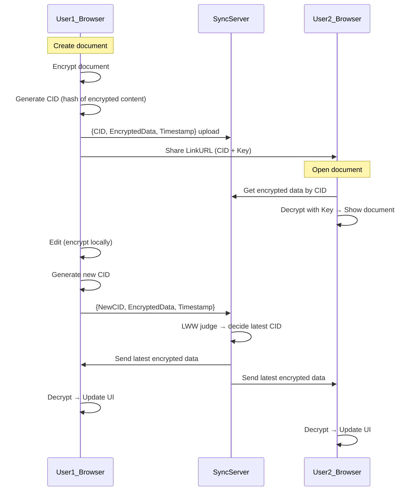
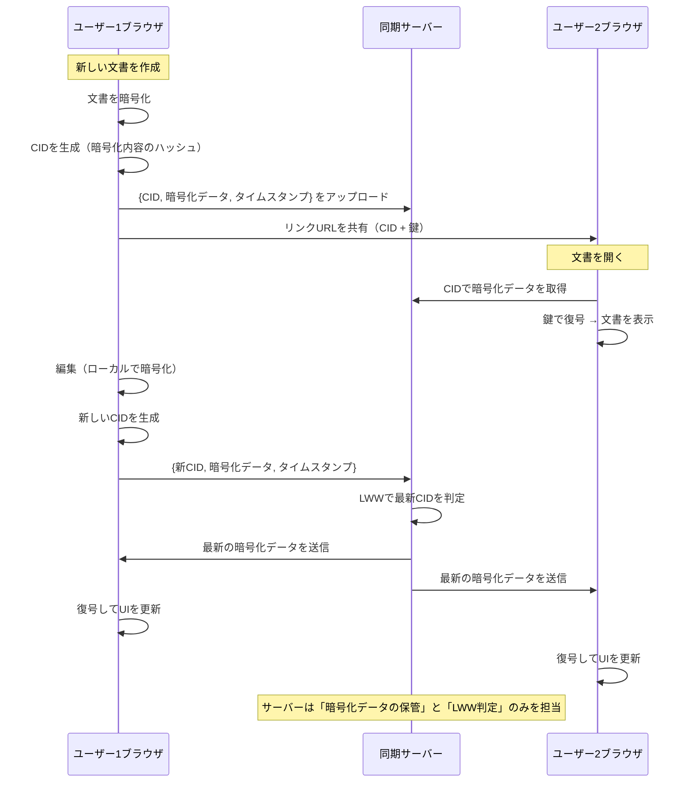

# アプリケーション設計ドキュメント

## 目的

ハッカソンで開発するアプリケーションのフロント側の設計を書いていく。

---

## アプリケーションについて

「サーバーがテキスト内容を読めない状態でユーザー同士がリアルタイムにテキストを共同編集できるアプリケーション」

- Google Docs 的な共同編集体験を提供  
- サーバーはどのような操作が行われたか、どんなコンテンツがあるかを知ることができない  
- サーバーの役割は、暗号化状態のまま **LWW に基づいて最新状態を判定**し、中継する  

---

## ユースケース

- ユーザーはブラウザで新しい文書を作成する  
- 文書はリンク（鍵を含むURL）で共有可能  
- 他のユーザーはリンクを知っていれば参加可能  
- 編集内容、操作は全て暗号化され同期サーバーを経由して他クライアントに配信される  
- サーバーは暗号化された operation/payload を受け取り、LWWに基づいて「最新」かどうかだけを判断  
- クライアントは受け取った暗号化データを復号化し、自身のUIに反映する  

---

## 機能リスト

- 文書作成・編集（text）  
- リアルタイム共同編集  
- ドキュメントの共有（リンクベース）  
- 鍵の生成と配布（URLに埋め込み or 別途共有）  

---

## 画面設計

- **テキストのエディタ画面**  
  - プレーンテキストのみ or リッチテキスト対応  
- **共有ダイアログ**  
  - リンクのコピー  

---

## 使えそうなライブラリ

**UI（テキスト）**  
- **CodeMirror 6**  
  - 軽量でカスタマイズしやすいテキストエディタ  
  - プレーンテキスト用途に適する  
- **Slate.js**  
  - React向けのリッチテキストフレームワーク  
  - JSONベースデータモデル → 暗号化前にシリアライズ可能  
- **TipTap**  
  - リッチテキスト志向（Notion/Google Docs ライク）  
  - PoC段階ではやや重厚  

**暗号ライブラリ**  
- 未選定（AES-GCM, WebCrypto API, libsodium など検討中）  

---

## ディレクトリ構成
```
src/
 ├── app/
 │    └── editor/
 │         ├── page.tsx
 │
 ├── components/
 │    └── Editor.tsx          # エディタUI
 │
 ├── application/
 │
 ├── infrastructure/
 │
 └── utils/
```

## シーケンス図




## JSON例
### 暗号化前のJSON
```json
{
  "text": "hello, world",
  "timestamp": 1736812345678
}
```

### リクエスト例
```json
{
  "id": "doc-1234",
  "content": "Q0FMAACf0sh84xzmkRZ3e1PY0lY9e+0i9Nxk21v8..."
}
```

### サーバーからの push 例
```json
{
  "id": "doc-1234",
  "content": "Q0FMAACf0sh84xzmkRZ3e1PY0lY9e+0i9Nxk21v8...",
  "timestamp": 1736812345678,
  "latest": true
}
```

## 受信後の処理順
1. サーバーからメッセージを受け取る
2. JSONをパースする
3. 暗号化された content を復号する
4. 復号結果をさらに JSON パースする
5. { text, timestamp } を取り出す
6. UIに反映する
7. ローカル状態を更新する

### 処理フロー図:
```
受信(JSON文字列)
   ↓
JSON.parse()
   ↓
暗号化データ(content)を復号
   ↓
復号後JSONをさらにJSON.parse()
   ↓
{text, timestamp} を取り出す
   ↓
UIに反映
   ↓
ローカル状態を更新
```
