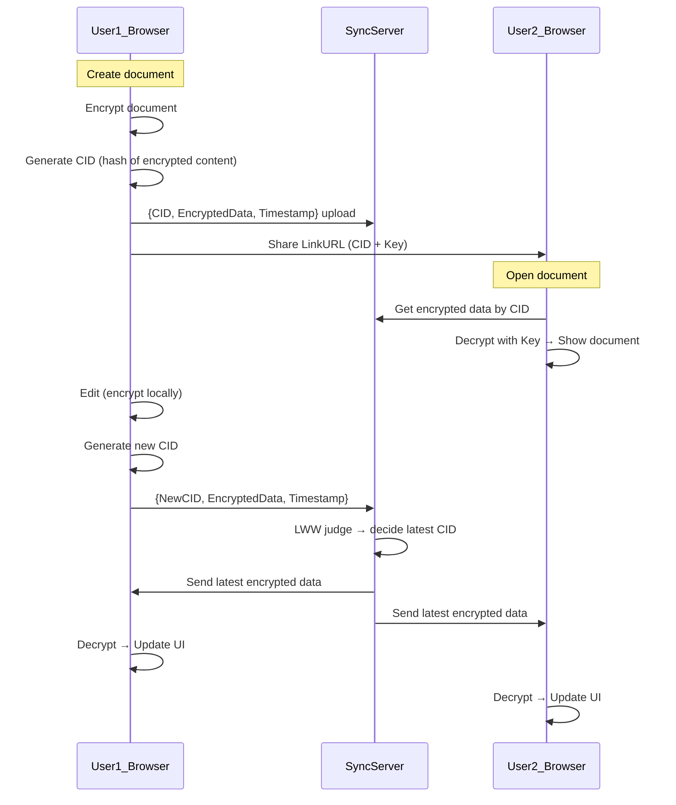

# encrypted-AutoMerge
## Table of Contents
- introduction

## Introduction
encrypted-AutoMerge は、**Fully Homomorphic Encryption (FHE)** と **CRDT (Conflict-free Replicated Data Type)** の仕組みを組み合わせ、コンテンツの自動統合を実現するための実装である。本システムは **End to End Encryption(E2EE)** を前提に設計されており、データに対して主権を持つユーザー以外は、コンテンツの内容やメタデータにアクセスすることはできない。

私たちのチームは、ユーザー自身が完全にデータの主権を持つことを可能にする分散システム Monas を開発している。本実装はその一部として位置づけられ、特に コンテンツを秘匿したまま状態を収束させる ための機能を担う。

ここでいう「自動統合 (AutoMerge)」は、複数のユーザーが同じコンテンツを更新した場合に発生する競合を、自動的に解決して最終的な状態を決定する仕組みを指す。本プロトタイプではまず第一歩として、**LWW (Last-Write-Wins)** ポリシーを採用し、暗号化された状態でのタイムスタンプ比較に基づいて新しい内容を選択する方式を実現した。

将来的には、単なる「置き換え」ではなく、テキストを対象とした **差分統合 (CRDTマージ)** を暗号化状態で行うことを目指している。本稿ではその背景、実装、課題、そして今後の展望について述べる。

## Background
### CRDTとは？
**CRDT (Conflict-free Replicated Data Type)** は、分散環境における複数のレプリカが同時に更新されても、最終的に自動的に収束するデータ構造である。CRDTの強みは、中央調停なしで一貫した状態を保証できる点にある。
- 特徴:
  - 可換性・冪等性・単調性を満たすように設計されている
  - ネットワーク分断や遅延があっても、全ての更新が伝搬すると同じ最終状態に到達する
- 代表的なCRDT:
  - カウンタ（例: G-Counter）
  - 集合（例: OR-Set）
  - テキスト編集（例: RGA, Logoot, LSEQ）

私たちの焦点は、テキスト編集用のCRDTにあり、将来的には暗号化状態のまま文字列操作を統合することを目指している。

### FHEとは？
**FHE (Fully Homomorphic Encryption)** は、暗号化されたデータに対して直接計算を行い、その結果を復号すると平文上で計算した結果と一致する暗号方式である。

### TFHEとは？
今回のプロトタイプでは、FHEの中でも **TFHE (Fast Fully Homomorphic Encryption over the Torus)** を採用した。TFHEは、特に ブーリアン回路（bit単位の処理） に強みを持ち、比較演算のような処理を効率的に実行できる。
- 特徴:
  - 1ビット単位の暗号化に基づく
  - NANDゲートなどの基本演算を暗号化状態で実行可能
  - 高速なブートストラップ処理により、深い回路でも計算継続が可能
- 利用意義
  - LWWポリシーでは「どちらのタイムスタンプが新しいか」を比較する必要がある

### LWWとは？
**LWW (Last-Write-Wins)** は、CRDTにおける最もシンプルな統合ポリシーのひとつである。競合が発生した際に、タイムスタンプの新しい更新を勝者として採用する。

今回のプロトタイプでは、暗号化された状態でLWWを実現することを第一のゴールとした。具体的には、TFHEを用いて暗号化されたタイムスタンプの比較を行い、新しい方の更新を選択する仕組みを構築した。

### 大前提
私たちは現在、Monas という分散システムを開発している。そこでは State node と呼ばれるノード群が存在し、コンテンツの状態（因果関係）を DAG構造 として保持している。これにより検証可能性を担保しているが、この構造は 半順序 にとどまるため、最終的には 線形化 が必要である。

現状、線形化の方法（マージポリシー）はアプリケーションや開発者が自由に選択できるようにしており、私たち自身もそのポリシーの研究と議論を進めている。

今回のテーマは、その中でも特に難易度が高い 「コンテンツの内容を秘匿したまま差分も含めて自動統合する」 という課題である。暗号化状態での統合は容易ではなく計算コストも大きいため、まずは第一段階として、TFHEを用いた暗号化タイムスタンプ比較によるLWW方式を実装した。これにより、秘匿性を保ったまま「どちらの更新が最新か」を判定し、自動的に状態を収束させることが可能になった。

## System Overview

## シーケンス図

## Prototype Implementation

## Future Directions
### Toward Distributed Auto-Merge
今回のプロトタイプでは単一の同期サーバーを用いたが、最終的な目標は 分散環境における自動統合 である。
Monasでは複数の State node が存在し、それぞれが因果関係をDAG構造として保持する。このため、将来的には 異なるState node間でのDAG統合 と コンテンツの収束 を両立させる必要がある。
### Toward Text-based CRDT under Encryption
本研究の最終的な目標は、単純な置き換えではなく、差分を含めたテキストCRDTのマージを暗号化状態で実現することである。
これは、数学的には 最小上界 (Least Upper Bound) を求める操作に相当する。計算量は大きくなるが、実用に耐えうる形での効率化を模索していく。
### Client-side Merge with Proofs
もう一つの選択肢として、クライアント側で復号して統合を行う方式がある。この場合、暗号化状態での統合は不要となり、実現性は高い。
しかしその場合、State nodeや他の参加者が「正しく統合が行われたか」を直接確認できないため、ゼロ知識証明 (ZKP) を用いた検証手法を組み合わせることが有望である。